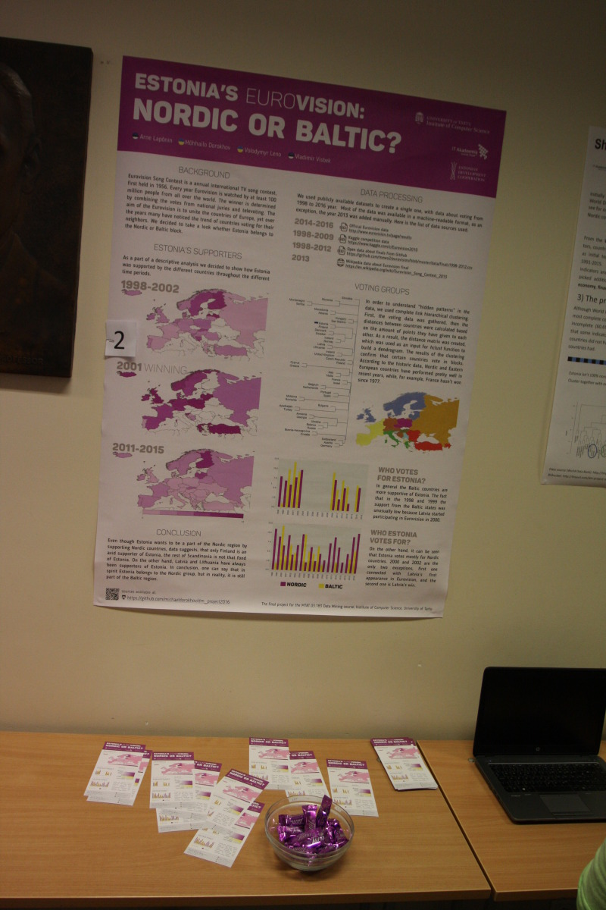

Estonia's euro-Vision: Nordic or Baltic?
-
Final project for the **MTAT.03.183 Data Mining** course

[Institute of Computer Science](http://www.cs.ut.ee/en) @ 
[University of Tartu](http://www.ut.ee/en)

### The Story

[Eurovision](https://en.wikipedia.org/wiki/Eurovision_Song_Contest) is an annual international TV song contest, first help in 1956. Every year it is watched by at least 100 million of people all over the world. The winner is determined by combining the votes from national juries and televoting. In the recent years many have noticed the trend of countries voting not for a specific performer, but according to their sympathy to other countries, mainly to neighbors. We decided to take a look on the Eurovision data and reveal the truth.

### Approach

We used *descriptive analysis*, *data visualisation* on a map and *complete-link hierarchical clustering* that produced a dendrogram with countries clusters. The same code could be modified so you can achieve the same results for your country!

### Results

Check out the [poster](img/Project_Poster.png) and the [leaflet](img/Project_Leaflet.png) of the project.

### Team
Students of [Software Engineering Master Program](http://software.cs.ut.ee/)
* Arne Lapõnin
* Mykhailo Dorokhov
* Volodymyr Leno
* Vladimir Visbek

Appendix: photo from the course poster session
-

Photo is taken by [prof. Jaak Vilo](http://biit.cs.ut.ee/~vilo)
